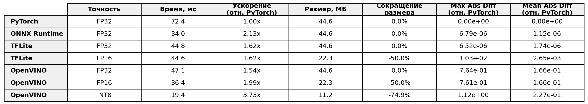
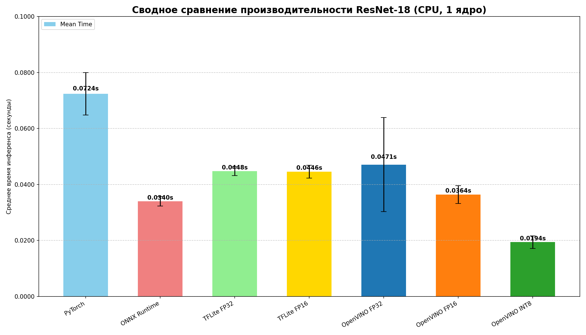
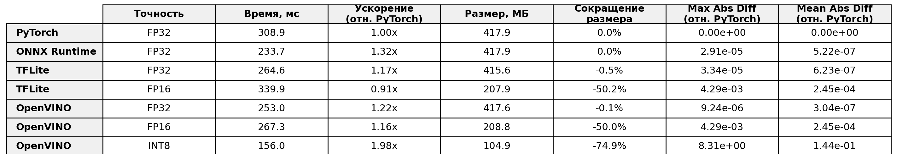
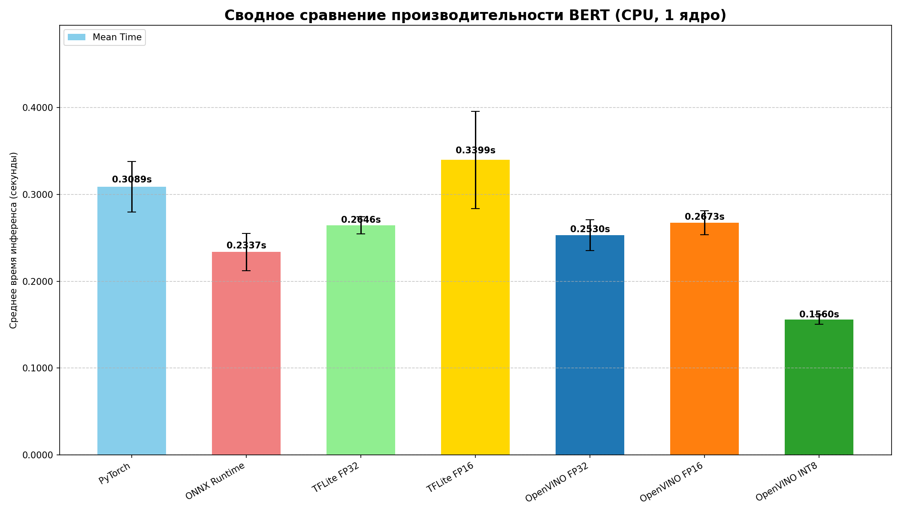
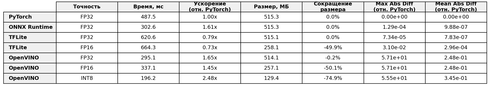
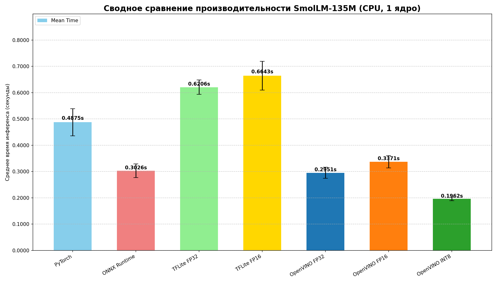

# Квантизация моделей и бенчмаркинг производительности

Этот репозиторий представляет собой комплексный конвейер для конвертации, квантизации и сравнения производительности нейронных сетей. Проект демонстрирует полный цикл работы с тремя различными моделями (ResNet18, BERT, SmolLM), переводя их из исходного формата PyTorch в оптимизированные для инференса форматы ONNX, TFLite и OpenVINO IR (FP32, FP16, INT8).

Весь процесс инкапсулирован в Docker, что обеспечивает полную воспроизводимость и изоляцию от локальной среды.

## Структура проекта

Проект разделен на три независимых, но последовательно выполняемых конвейера:

```
Model-quantization-benchmark/
├── resnet_bert_inference/    # Этап 1: Конвертация ResNet и BERT в ONNX/TFLite
├── smollm_inference/  # Этап 2: Конвертация SmolLM в ONNX/TFLite
└── openvino_inference/       # Этап 3: Конвертация в OpenVINO, квантизация и финальный бенчмарк
```

## Рабочий процесс (Workflow)

Конвейеры необходимо выполнять в строгой последовательности, так как результаты каждого этапа являются входными данными для последующих.

1.  **Этап 1: ResNet & BERT**
    *   **Вход:** Предобученные модели из `torchvision` и `transformers`.
    *   **Процесс:** Запускается Docker-конвейер, который скачивает модели, конвертирует их в ONNX и TFLite, сравнивает производительность и сохраняет артефакты.
    *   **Выход:** `.onnx` модели и эталонные выходы (`.npy`) для ResNet и BERT.

2.  **Этап 2: SmolLM**
    *   **Вход:** Локально скачанная модель SmolLM.
    *   **Процесс:** Аналогичный Docker-конвейер для конвертации и бенчмаркинга SmolLM.
    *   **Выход:** `.onnx` модель и эталонный выход (`.npy`) для SmolLM.

3.  **Этап 3: OpenVINO**
    *   **Вход:** Все `.onnx` модели и `.npy` выходы, полученные на Этапах 1 и 2.
    *   **Процесс:** Финальный Docker-конвейер, который:
        *   Конвертирует ONNX в OpenVINO IR (FP32/FP16).
        *   Квантует модели в INT8.
        *   Проводит исчерпывающий бенчмаркинг производительности и точности.
    *   **Выход:** Финальные IR-модели (FP32, FP16, INT8) и итоговые графики сравнения.

## Предварительные требования

*   Установленный и запущенный [Docker](https://www.docker.com/get-started).
*   Установленный [Git](https://git-scm.com/downloads) для клонирования репозитория.

## Пошаговая инструкция по запуску

### Этап 1: Конвейер ResNet & BERT

1.  **Перейдите в папку проекта:**
    ```bash
    cd resnet_bert_inference
    ```
2.  **Соберите Docker-образ.** Этот процесс автоматически скачает, сконвертирует и протестирует модели.
    ```bash
    docker build -t resnet_bert_pipe .
    ```
3.  **Извлеките результаты.** Они понадобятся для финального этапа.
    ```bash
    mkdir -p ./docker_results
    ID=$(docker create resnet_bert_pipe)
    docker cp $ID:/app/resnet18.onnx ./docker_results/
    docker cp $ID:/app/bert_model.onnx ./docker_results/
    docker cp $ID:/app/pytorch_outputs ./docker_results/
    docker rm -v $ID
    cd ..
    ```

### Этап 2: Конвейер SmolLM

1.  **Скачайте модель SmolLM.** Это необходимо сделать вручную.
    *   **Ссылка:** [**Скачать smollm_local_model.zip**](https://disk.yandex.ru/d/wbFN_vuhuHj9iA)
    *   Распакуйте архив и поместите папку `smollm_local_model` внутрь директории `smollm_inference_pipeline/`.

2.  **Перейдите в папку проекта:**
    ```bash
    cd smollm_inference_pipeline
    ```
3.  **Соберите Docker-образ:**
    ```bash
    docker build -t smollm_pipe .
    ```
4.  **Извлеките результаты:**
    ```bash
    mkdir -p ./docker_results
    ID=$(docker create smollm_pipe)
    docker cp $ID:/app/smollm_135m.simplified.onnx ./docker_results/
    docker cp $ID:/app/pytorch_outputs ./docker_results/
    docker rm -v $ID
    cd ..
    ```

### Этап 3: Финальный конвейер OpenVINO

1.  **Перейдите в папку проекта:**
    ```bash
    cd openvino_inference
    ```
2.  **Подготовьте рабочее пространство.** Скопируйте все артефакты, полученные на предыдущих этапах, в локальные папки.
    ```bash
    # Копируем ONNX модели
    cp ../resnet_bert_inference/docker_results/resnet18.onnx ./models/onnx/
    cp ../resnet_bert_inference/docker_results/bert_model.onnx ./models/onnx/
    cp ../smollm_inference_pipeline/docker_results/smollm_135m.simplified.onnx ./models/onnx/smollm_135m.onnx

    # Копируем эталонные выходы PyTorch
    cp ../resnet_bert_inference/docker_results/pytorch_outputs/torch_output_resnet.npy ./data/pytorch_outputs/
    cp ../resnet_bert_inference/docker_results/pytorch_outputs/torch_output_bert.npy ./data/pytorch_outputs/
    cp ../smollm_inference_pipeline/docker_results/pytorch_outputs/torch_output_smollm.npy ./data/pytorch_outputs/

    # Копируем токенизатор SmolLM
    cp -r ../smollm_inference_pipeline/smollm_local_model/ ./models/
    ```
3.  **Соберите финальный Docker-образ.** На этом шаге произойдет конвертация в OpenVINO, квантизация и финальный бенчмаркинг.
    ```bash
    docker build -t openvino_pipe .
    ```
4.  **Извлеките итоговые результаты:**
    ```bash
    mkdir -p ./docker_results
    ID=$(docker create openvino_pipe)
    docker cp $ID:/app/models/ir_fp32 ./docker_results/
    docker cp $ID:/app/models/ir_fp16 ./docker_results/
    docker cp $ID:/app/models/ir_int8 ./docker_results/
    docker cp $ID:/app/benchmark_full_results_resnet.png ./docker_results/
    docker cp $ID:/app/benchmark_full_results_bert.png ./docker_results/
    docker cp $ID:/app/benchmark_full_results_smollm.png ./docker_results/
    docker rm -v $ID
    cd ..
    ```

## Итоговые результаты
Пример файорв create_table.py, create_summary_graphs.py для получения таблиц и графиков.







