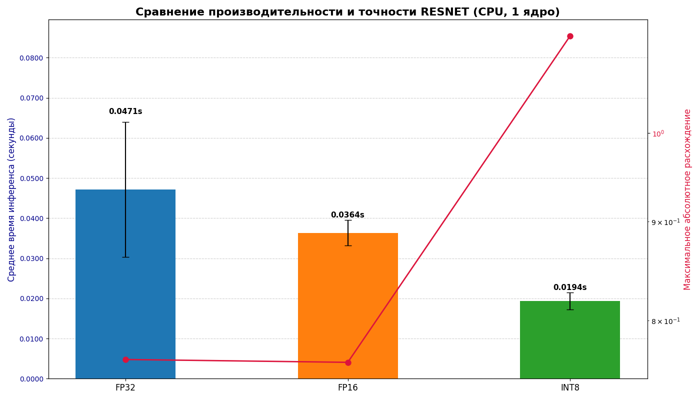

# Конвейер OpenVINO с Docker: Конвертация, Квантизация и Бенчмаркинг

Этот проект автоматизирует полный цикл обработки моделей (ResNet, BERT, SmolLM) с помощью OpenVINO внутри Docker-контейнера.

**Автоматизированные шаги:**
1.  **Конвертация** из ONNX в OpenVINO Intermediate Representation (IR) в форматах FP32 и FP16.
2.  **Квантизация** моделей FP32 в INT8 с использованием NNCF.
3.  **Бенчмаркинг** всех версий (FP32, FP16, INT8) для сравнения скорости и точности.

## Предварительные требования

*   Установленный и запущенный [Docker](https://www.docker.com/get-started).
*   Результаты работы предыдущих этапов (ONNX-модели, выходы PyTorch, токенизатор SmolLM).

## Шаг 1: Подготовка Build Context

**ВАЖНО:** Перед сборкой Docker-образа необходимо подготовить "контекст сборки". Это означает, что все нужные артефакты (модели, данные) должны быть скопированы в соответствующие папки **внутри `openvino_inference`**.

1.  **Скопируйте ONNX-модели** в `./models/onnx/`:
    ```bash
    # Команды выполняются из папки openvino_inference/

    cp ../resnet_bert_inference/docker_results/resnet18.onnx ./models/onnx/
    cp ../resnet_bert_inference/docker_results/bert_model.onnx ./models/onnx/
    cp ../smollm_inference/docker_results/smollm_135m.onnx ./models/onnx/smollm_135m.onnx
    ```

2.  **Скопируйте эталонные выходы PyTorch** в `./data/pytorch_outputs/`:
    ```bash
    cp ../resnet_bert_inference/docker_results/pytorch_outputs/*.npy ./data/pytorch_outputs/
    cp ../smollm_inference_pipeline/docker_results/pytorch_outputs/*.npy ./data/pytorch_outputs/
    ```

3.  **Скопируйте токенизатор SmolLM** в `./models/`:
    ```bash
    cp -r ../smollm_inference_pipeline/smollm_local_model/ ./models/
    ```

После этого шага папка `openvino_inference` полностью готова к сборке Docker-образа.

## Шаг 2: Сборка Docker-образа

Эта команда запустит процесс сборки. На этом этапе будут установлены все зависимости, а затем выполнены все скрипты конвейера (`convert_to_ir.sh`, `run_nncf_quantization.py`, `run_full_benchmark.py`).

```bash
# Находясь в папке openvino_inference/
docker build -t openvino_pipe .
```
*   **Внимание:** Этот процесс может занять значительное время (20-40 минут). Внимательно следите за логами в консоли — вы увидите этапы конвертации, квантизации и итоговые таблицы бенчмарков.

## Шаг 3: Извлечение результатов

Все сгенерированные артефакты (IR-модели и графики) находятся внутри созданного Docker-образа. Чтобы скопировать их на ваш локальный компьютер:

1.  Создайте на хосте папку для результатов:
    ```bash
    mkdir -p ./docker_results
    ```

2.  Создайте временный контейнер и скопируйте из него все результаты:
    ```bash
    ID=$(docker create openvino_pipe)

    echo "Копирование всех IR-моделей (FP32, FP16, INT8)..."
    docker cp $ID:/app/models/ir_fp32 ./docker_results/
    docker cp $ID:/app/models/ir_fp16 ./docker_results/
    docker cp $ID:/app/models/ir_int8 ./docker_results/

    echo "Копирование графиков с результатами бенчмарков..."
    docker cp $ID:/app/benchmark_full_results_resnet.png ./docker_results/
    docker cp $ID:/app/benchmark_full_results_bert.png ./docker_results/
    docker cp $ID:/app/benchmark_full_results_smollm.png ./docker_results/

    docker rm -v $ID
    echo "Все файлы скопированы в папку ./docker_results"
    ```

## Ожидаемые результаты

После выполнения всех шагов в папке `openvino_inference/docker_results/` вы найдете:
*   Папки `ir_fp32`, `ir_fp16`, `ir_int8` с полным набором сконвертированных и квантованных моделей.
*   Три `.png` файла с графиками, визуализирующими производительность и точность для каждой из трех моделей.


