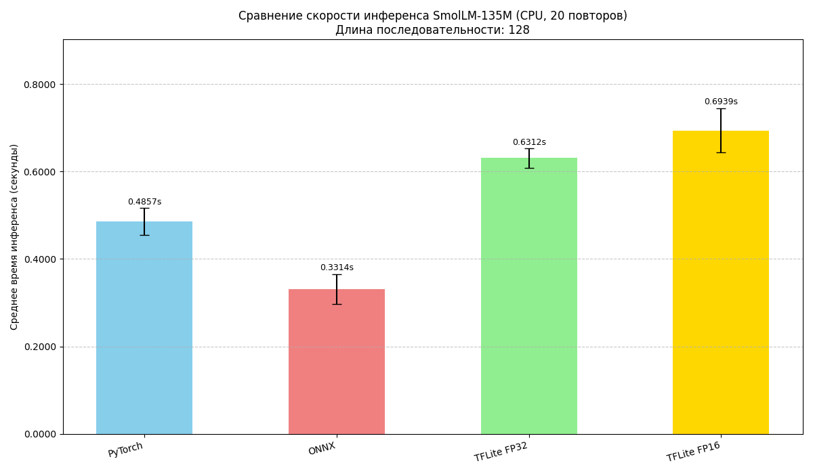

# Конвейер SmolLM с использованием Docker

Этот проект демонстрирует полный конвейер для конвертации модели `SmolLM-135M` из формата PyTorch в ONNX и TFLite, а также сравнивает их скорость инференса (вывода) на CPU. Вся обработка происходит внутри Docker-контейнера.

## Предварительные требования

*   Установленный и запущенный [Docker](https://www.docker.com/get-started).
*   Установленный [Git](https://git-scm.com/downloads) для клонирования репозитория.
*   Достаточно свободного места на диске (~1-2 ГБ для модели и ~5-10 ГБ для Docker-образа).

## Шаг 1: Подготовка к запуску (Загрузка модели)

**ВАЖНО:** Исходная модель `SmolLM-135M` не включена в этот репозиторий из-за ее большого размера. Перед сборкой Docker-образа вам необходимо скачать ее и разместить в правильном месте.

1.  **Скачайте архив с моделью** по следующей ссылке:
    [**Скачать smollm_local_model.zip**](https://disk.yandex.ru/d/wbFN_vuhuHj9iA)

2.  **Распакуйте архив.** После распаковки у вас появится папка с названием `smollm_local_model`.

3.  **Поместите папку `smollm_local_model`** внутрь этой директории (`smollm_inference`).

После этого шага структура вашей папки `smollm_inference` должна выглядеть так:

```
smollm_inference_pipeline/
├── smollm_local_model/       # <-- Папка, которую вы скачали и распаковали
│   ├── config.json
│   ├── model.safetensors
│   └── ... (другие файлы модели)
├── Dockerfile
├── requirements.txt
├── smollm_onnx.py
├── smollm_tflite.py
├── compare_smollm_inference.py
└── Readme.md
```

Теперь вы готовы к следующему шагу.

## Шаг 2: Сборка Docker-образа

1.  **Клонируйте репозиторий (если еще не сделали):**
    ```bash
    git clone https://github.com/MAKK75/Model-quantization-benchmark.git
    ```

2.  **Перейдите в папку проекта:**
    ```bash
    cd Model-quantization-benchmark/smollm_inference_pipeline
    ```
    *Все последующие команды выполняются из этой директории.*

3.  **Соберите Docker-образ:**
    Эта команда запустит процесс сборки образа `smollm_pipe`. Во время сборки будут выполнены все шаги, описанные в `Dockerfile`: установка зависимостей, копирование скачанной вами локальной модели, её конвертация и запуск скрипта сравнения производительности.

    ```bash
    docker build -t smollm_pipe .
    ```
    *   **Внимание:** Этот процесс может занять значительное время (15-30 минут и более) в зависимости от мощности вашего компьютера и скорости интернета. Внимательно следите за выводом в консоли.

## Шаг 3: Получение результатов (модели и график)

Все сгенерированные файлы находятся внутри собранного Docker-образа. Чтобы скопировать их на ваш локальный компьютер:

1.  Создайте на хосте папку для результатов:
    ```bash
    mkdir -p ./docker_results
    ```

2.  Создайте временный контейнер и скопируйте из него все артефакты:
    ```bash
    ID=$(docker create smollm_pipe)

    echo "Копирование результатов конвертации SmolLM..."
    docker cp $ID:/app/smollm_135m.onnx ./docker_results/
    docker cp $ID:/app/smollm_135m.simplified.onnx ./docker_results/
    docker cp $ID:/app/smollm_135m_tf_savedmodel ./docker_results/
    docker cp $ID:/app/smollm_135m_fp32.tflite ./docker_results/
    docker cp $ID:/app/smollm_135m_fp16.tflite ./docker_results/
    docker cp $ID:/app/inference_times_smollm_comparison.png ./docker_results/

    echo "Копирование эталонных выходов PyTorch..."
    docker cp $ID:/app/pytorch_outputs ./docker_results/

    docker rm -v $ID
    echo "Все файлы скопированы в папку ./docker_results"
    ```
## Результаты производительности

После выполнения конвейера в папке `docker_results` будет сгенерирован график, показывающий результаты сравнения производительности на CPU.

*   **Модель:** `SmolLM-135M`
*   **Условия:** CPU, 20 повторов, длина последовательности 128




## Анализ результатов

### Производительность и влияние Flex Ops

После сборки вы найдете график `inference_times_smollm_comparison.png` в папке `docker_results`. Можно заметить, что TFLite-модели работают значительно медленнее, чем ONNX и даже PyTorch. Это ожидаемое поведение, связанное с использованием **Flex Ops** — механизма совместимости, который позволяет TFLite выполнять операции, не поддерживаемые стандартным набором инструкций, за счет вызова "тяжелой" среды TensorFlow. Эти вызовы создают большие накладные расходы, которые нивелируют потенциальное ускорение.

### Точность вычислений

Скрипт сравнения выводит в лог сборки информацию о различиях в выходах моделей (`Close: False`). Это также нормально для сложных моделей, прошедших многоэтапную конвертацию. Разные фреймворки (PyTorch, ONNX Runtime, TensorFlow) имеют небольшие различия в реализации математических операций, что приводит к накоплению незначительных ошибок и, как следствие, к неидентичным, но численно близким результатам.
